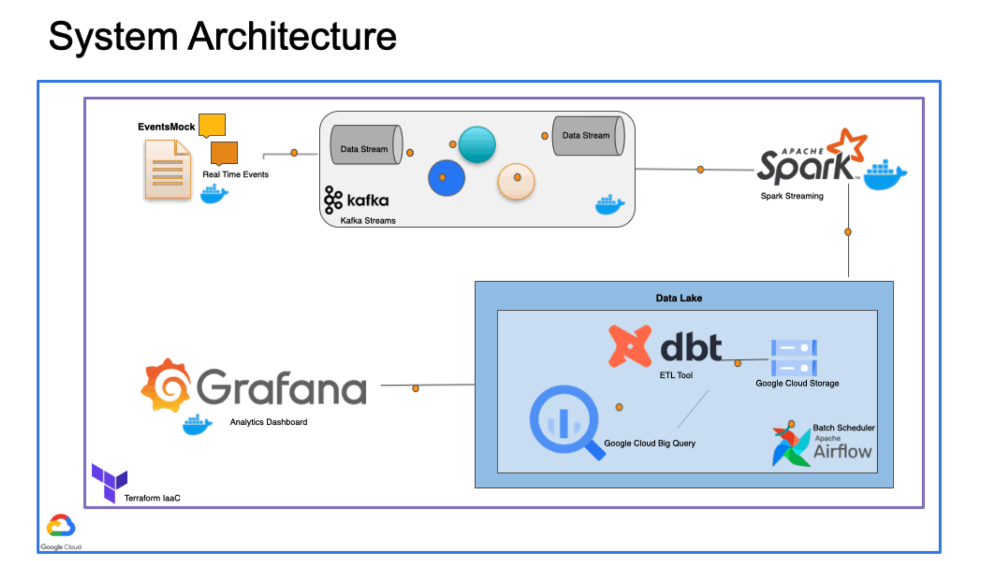
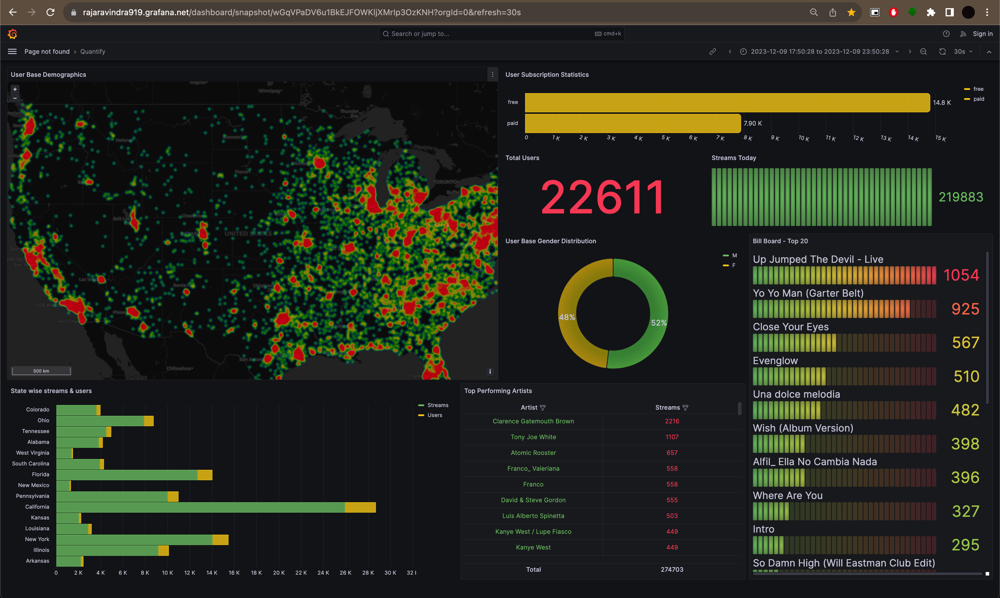

# Project Quantify

## Description

The main objective of this project is to provide a data engineering solution to generate valuable insights in terms of real-time user specific statistics about a typical industrial software product which will aid in betterment of product and also improve the user experience. Project Quantify focuses on building a robust data pipeline  which can generate descriptive analytics by aggregating service logs, engine logs, api responses, network events, frontend and system level events etc., which are usually found in any software system. Although this project is confined to demonstrating a system working on top of a music streaming application such as Spotify or Youtube Music, the main goal is to provide a generic solution which can cover areas other than music. With this scope this project integrates a lot of tools constructing a Data Lake with the help of Spark and then outputs few value adding dashboard screens using Data Warehouse for a business specific end user who aspires for deeper insights about their product.

### Architecture

### Final Result

- Link to public snapshot of grafana dashboard [https://rajaravindra919.grafana.net/dashboard/snapshot/wGqVPaDV6u1BkEJFOWKljXMrIp3OzKNH?orgId=0&refresh=30s](https://rajaravindra919.grafana.net/dashboard/snapshot/wGqVPaDV6u1BkEJFOWKljXMrIp3OzKNH?orgId=0&refresh=30s)

## Setup

If you already have a Google Cloud account and a working terraform setup, you can skip the pre-requisite steps.

- Google Cloud Platform. 
  - [GCP Account and Access Setup](setup/gcp.md)
  - [gcloud alternate installation method - Windows](https://github.com/DataTalksClub/data-engineering-zoomcamp/blob/main/week_1_basics_n_setup/1_terraform_gcp/windows.md#google-cloud-sdk)
- Terraform
  - [Setup Terraform](https://github.com/DataTalksClub/data-engineering-zoomcamp/blob/main/week_1_basics_n_setup/1_terraform_gcp/windows.md#terraform)

- Comission infra on GCP with Terraform - [Setup](setup/terraform.md)
- Extra notes on SSH and forwarding ports - [Setup](setup/ssh.md)
- Kafka and Event Mock - [Setup](setup/kafka.md)
- Spark setup and streams - [Setup](setup/spark.md)
- Airflow and DAGs - [Setup](setup/airflow.md)
